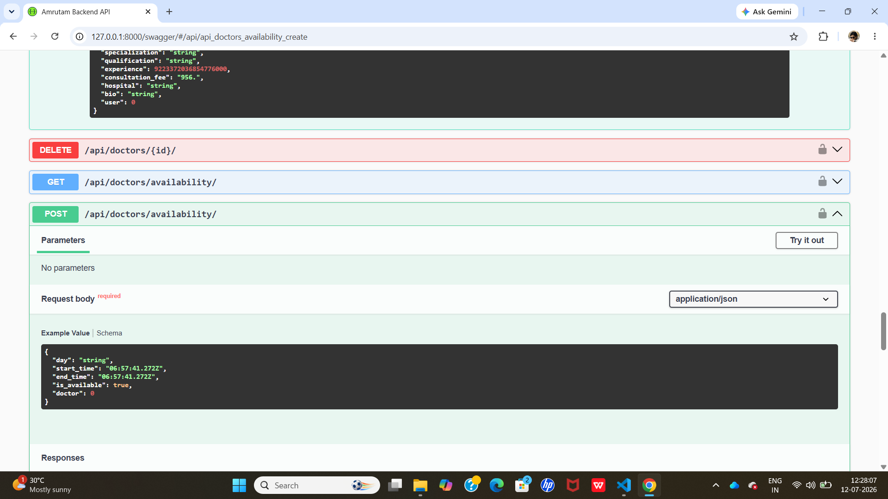
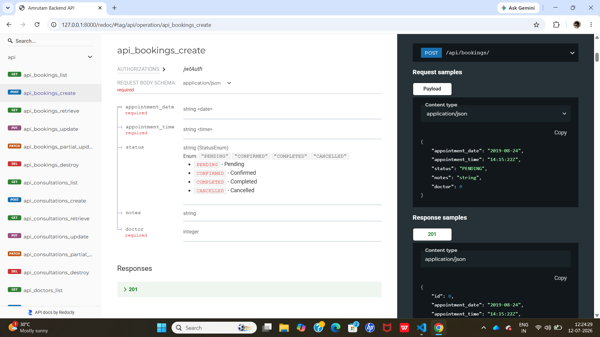
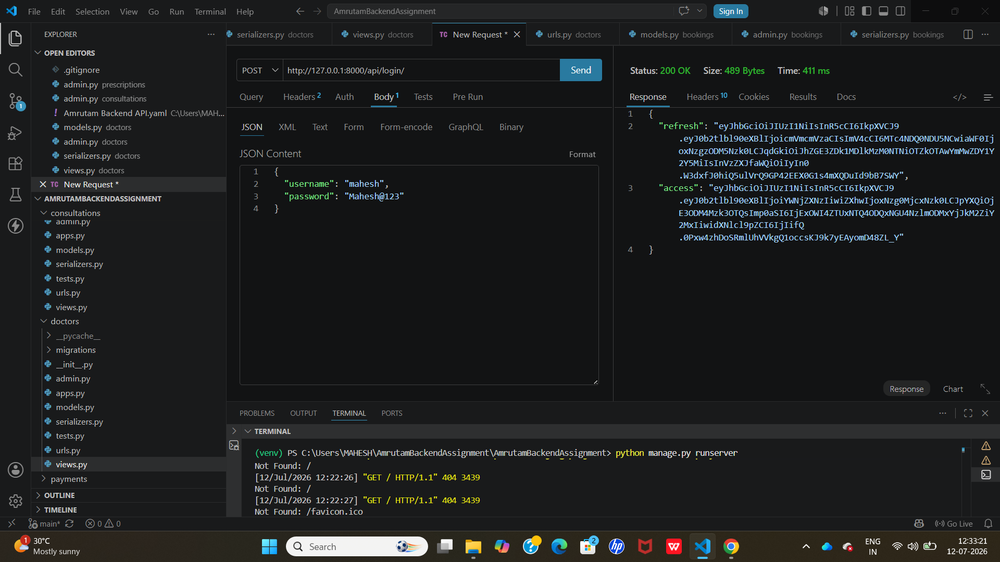
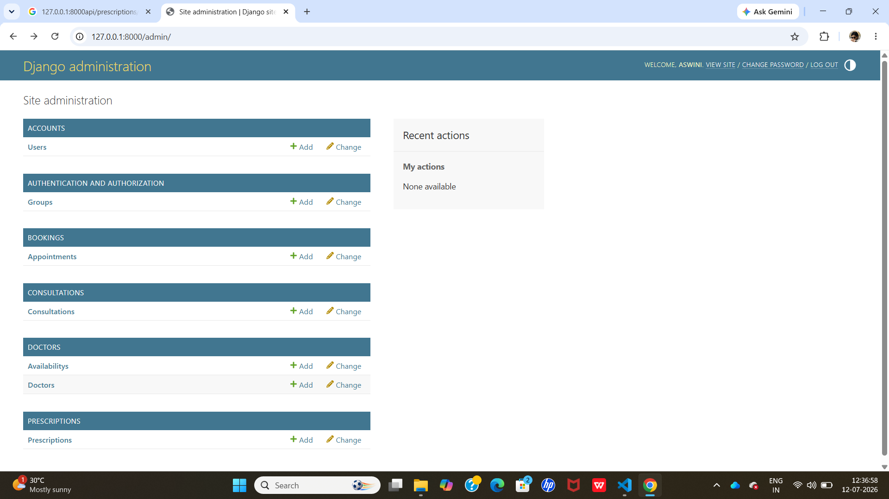

## Project Overview

This project is a backend REST API developed using Django and Django REST Framework for managing doctors, patients, appointments, consultations, and prescriptions. The application uses JWT authentication, role-based permissions, Swagger API documentation, and search/filtering capabilities.

## 📸 Screenshots

### Swagger API Documentation


---

### ReDoc API Documentation



---

### JWT Authentication (Login)



---

### Django Admin Panel




---

## Features

* JWT Authentication (Register & Login)
* Custom User Model
* Role-Based Access Control
* Doctor Management (CRUD)
* Doctor Availability Management
* Appointment Booking
* Prevent Double Booking
* Consultation Management
* Prescription Management
* Search, Filtering & Ordering
* Swagger API Documentation
* Admin Panel

---

## Technologies Used

* Python 3
* Django
* Django REST Framework
* Simple JWT
* SQLite
* drf-spectacular (Swagger)
* django-filter

---

## Installation

Clone the repository:

```bash
git clone <your-github-repository-url>
```

Move into the project folder:

```bash
cd AmrutamBackendAssignment
```

Create a virtual environment:

```bash
python -m venv venv
```

Activate the virtual environment:

Windows

```bash
venv\Scripts\activate
```

Install dependencies:

```bash
pip install -r requirements.txt
```

Run migrations:

```bash
python manage.py migrate
```

Start the development server:

```bash
python manage.py runserver
```

---

## API Endpoints

### Authentication

POST `/api/register/`

POST `/api/login/`

POST `/api/refresh/`

### Doctors

GET `/api/doctors/`

POST `/api/doctors/`

GET `/api/doctors/{id}/`

PUT `/api/doctors/{id}/`

DELETE `/api/doctors/{id}/`

### Availability

GET `/api/doctors/availability/`

POST `/api/doctors/availability/`

### Appointments

GET `/api/bookings/`

POST `/api/bookings/`

GET `/api/bookings/{id}/`

PUT `/api/bookings/{id}/`

DELETE `/api/bookings/{id}/`

### Consultations

GET `/api/consultations/`

POST `/api/consultations/`

### Prescriptions

GET `/api/prescriptions/`

POST `/api/prescriptions/`

GET `/api/prescriptions/{id}/`

PUT `/api/prescriptions/{id}/`

DELETE `/api/prescriptions/{id}/`

---

## Search & Filtering

Doctors:

```
GET /api/doctors/?specialization=Cardiologist
```

```
GET /api/doctors/?search=Cardiologist
```

```
GET /api/doctors/?ordering=-experience
```

Appointments:

```
GET /api/bookings/?status=PENDING
```

```
GET /api/bookings/?appointment_date=2026-07-15
```

```
GET /api/bookings/?ordering=-appointment_date
```

---

## Authentication

This project uses JWT Authentication.

Include the access token in the Authorization header:

```
Authorization: Bearer <access_token>
```

---

## Swagger Documentation

Open the following URLs after starting the server:

```
http://127.0.0.1:8000/swagger/
```

```
http://127.0.0.1:8000/redoc/
```

---

## Database

Default database:

* SQLite

Run migrations:

```bash
python manage.py makemigrations
python manage.py migrate
```

---

## Author

Mahesh

Backend Developer
